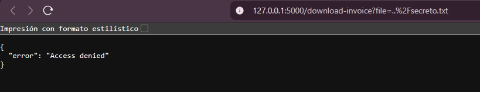
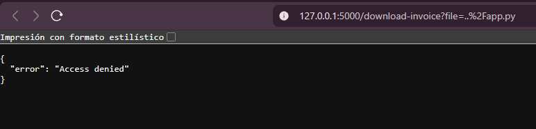
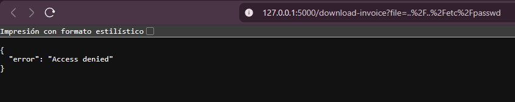
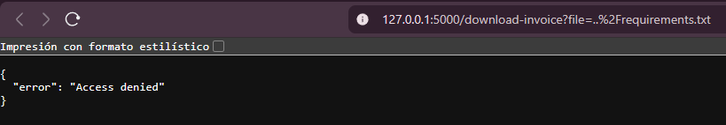
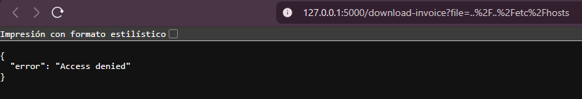

# RETEST — Verificación post-corrección

**Objetivo:** Mostrar los payloads utilizados para verificar que la versión segura (`app_seguro.py`) bloquea intentos de *Directory Traversal* y documentar la evidencia (capturas).

---

## Payloads probados y evidencia

> Cada payload se probó contra el endpoint `/download-invoice?file=<payload>` en el entorno de pruebas local. Las imágenes adjuntas muestran la respuesta del servidor / la UI tras cada intento.

1. **Payload:** `../secreto.txt`  
   

2. **Payload:** `../app.py`  
   

3. **Payload:** `../../etc/passwd`  
   

4. **Payload:** `../requirements.txt`  
   

5. **Payload:** `../../etc/hosts`  
   

---

## Observaciones generales

- Todos los intentos de traversal fueron **bloqueados** por la versión segura.  
- El servidor devolvió códigos de estado apropiados (403 / 404) y mensajes genéricos (por ejemplo: `Access denied`, `File not found`) sin exponer rutas o trazas internas.  
- Se registraron los intentos bloqueados en los logs del servidor para su auditoría.

---

## Conclusión

La prueba confirma que `app_seguro.py` mitiga los vectores de Directory Traversal probados en este re-test. Adjunta las capturas como evidencia en el repositorio y conserva los logs del servidor si necesitas pruebas adicionales para el informe final.
